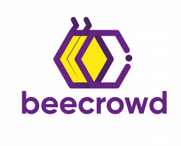

<h1 align="center" style="display:flex; flex-direction: row; justify-content: center; align-items: center">
    
    
</h1>

<p align="center">
  
  
  
  
  
  <a href="https://github.com/gabrielmaialva33/rust-beecrowd/commits/master">
    
      
  </a>
</p>

<br>

<p align="center">
    <a href="README.md">English</a>
    ·
    <a href="README-pt.md">Portuguese</a>
</p>

<p align="center">
  <a href="#bookmark-about">Sobre</a>&nbsp;&nbsp;&nbsp;|&nbsp;&nbsp;&nbsp;
  <a href="#computer-technologies">Tecnologias</a>&nbsp;&nbsp;&nbsp;|&nbsp;&nbsp;&nbsp;
  <a href="#wrench-tools">Ferramentas</a>&nbsp;&nbsp;&nbsp;|&nbsp;&nbsp;&nbsp;
  <a href="#package-installation">Instalação</a>&nbsp;&nbsp;&nbsp;|&nbsp;&nbsp;&nbsp;
  <a href="#memo-license">Licença</a>
</p>

<br>

## :bookmark: Sobre

**Rust-Beecrowd** É um repositório com minhas submissões de problemas do beecroed.

<br>

## :computer: Tecnologias

- **[Rust](https://www.rust-lang.org/)**
- **[Cargo](https://crates.io/)**
- **[Beecrowd](https://www.beecrowd.com.br/judge)**

<br>

## :wrench: Ferramentas

- **[IntelliJ IDEA](https://www.jetbrains.com/idea/)**
- **[Edge Microsoft](https://www.microsoft.com/en-us/edge/)**

<br>

## :package: Instalação

### :heavy_check_mark: **Pré-requisitos**

Os seguintes softwares devem estar instalados:

- **[Rust](https://www.rust-lang.org/tools/install)**
- **[Git](https://git-scm.com/)**
- **[Cargo](https://doc.rust-lang.org/cargo/getting-started/installation.html)**

<br>

### :arrow_down: **Clonando o repositório**

```sh
  $ git clone https://github.com/gabrielmaialva33/rust-beecrowd
```

<br>

### :arrow_forward: **Rodando o backend**

- :package: API

```sh
  $ cd rust-beecrowd
  # Para compilar a solução
  $ rustc ./src/beecrowd-submissions
```

<br>

## :memo: Licença

O projeto está sobre a licença [MIT](./LICENSE) ❤️

Gostou? Deixe uma estrela para ajudar o projeto ⭐