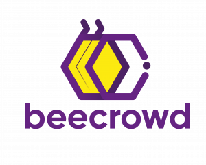

<div style="display:flex; flex-direction: row; justify-content: center; align-items: center">
  
  
</div>

<p align="center">
  
  
  
  
  
  <a href="https://github.com/gabrielmaialva33/rust-beecrowd/commits/master">
    
      
  </a>
</p>

<br>

<p align="center">
    <a href="README.md">English</a>
    ·
    <a href="README-pt.md">Portuguese</a>
</p>

<p align="center">
  <a href="#bookmark-about">About</a>&nbsp;&nbsp;&nbsp;|&nbsp;&nbsp;&nbsp;
  <a href="#computer-technologies">Technologies</a>&nbsp;&nbsp;&nbsp;|&nbsp;&nbsp;&nbsp;
  <a href="#wrench-tools">Tools</a>&nbsp;&nbsp;&nbsp;|&nbsp;&nbsp;&nbsp;
  <a href="#package-installation">Installation</a>&nbsp;&nbsp;&nbsp;|&nbsp;&nbsp;&nbsp;
  <a href="#memo-license">License</a>
</p>

<br>

## :bookmark: About

**Base RBAC** is a role-based access control base api that hopes to serve many projects.

<br>

## :computer: Technologies

- **[Rust](https://www.rust-lang.org/)**
- **[Cargo](https://crates.io/)**
- **[Beecrowd](https://www.beecrowd.com.br/judge)**

<br>

## :wrench: Tools

- **[IntelliJ IDEA](https://www.jetbrains.com/idea/)**
- **[Edge Microsoft](https://www.microsoft.com/en-us/edge/)**

<br>

## :package: Installation

### :heavy_check_mark: **Prerequisites**

The following software must be installed:

- **[Rust](https://www.rust-lang.org/tools/install)**
- **[Git](https://git-scm.com/)**
- **[Cargo](https://doc.rust-lang.org/cargo/getting-started/installation.html)**

<br>

### :arrow_down: **Cloning the repository**

```sh
  $ git clone https://github.com/gabrielmaialva33/rust-beecrowd
```

<br>

### :arrow_forward: **Running the application**

- :package: Running

```sh
  $ cd rust-beecrowd
  # To compile rust solution
  $ rustc ./src/beecrowd-submissions
```

<br>

## :memo: License

This project is under the **MIT** license. [MIT](./LICENSE) ❤️

Liked? Leave a little star to help the project ⭐